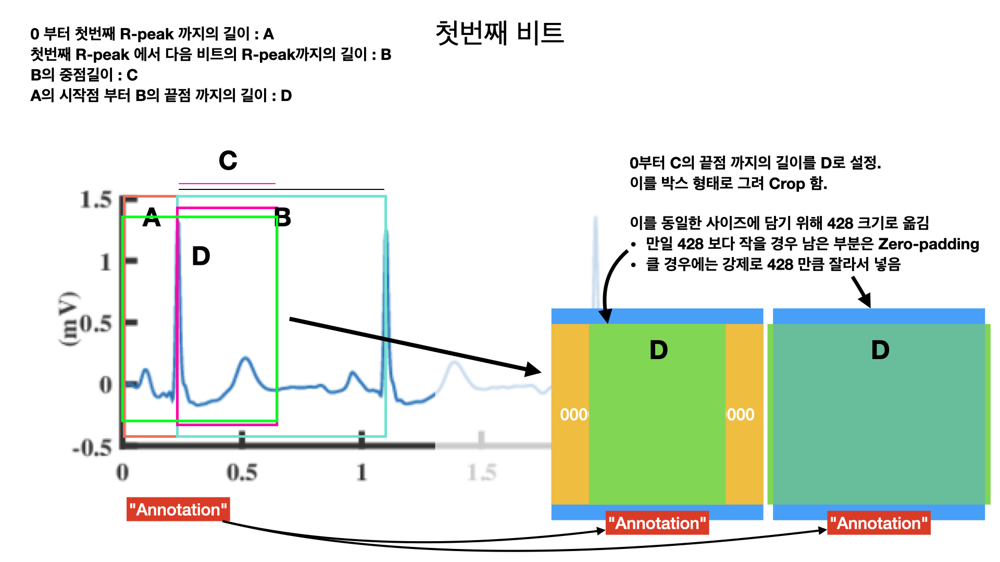
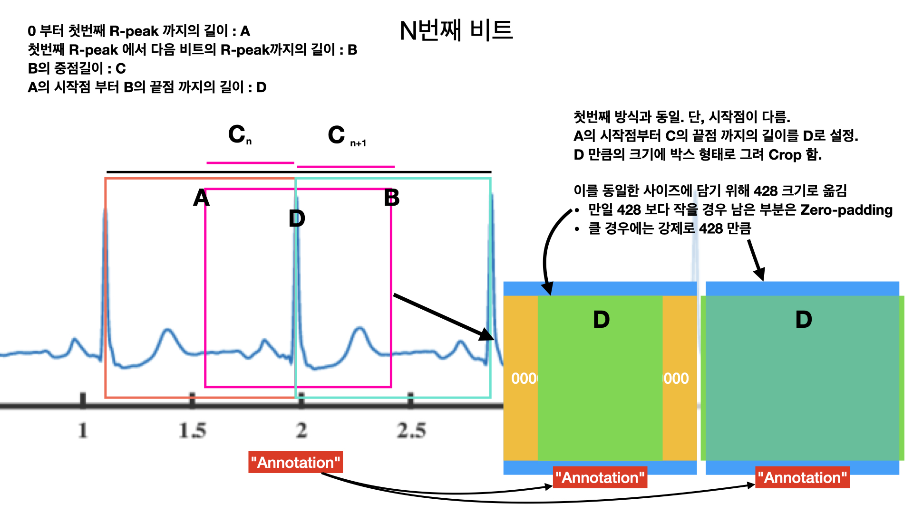

# ECG Beat Scrapper
R-R Interval 을 기점으로 비트를 잘라내는 프로젝트이다. 이론은 간단한데 코드로 작성하자니 어렵다.

# 그냥 "Zero-padding"
## Logic
여러 레코드마다 각각 비트 길이가 있고 그에 따른 비트 길이 또한 다르다. 대부분 논문에서는 비트를 뽑아 재가공 혹은 모델의 입맛에 맞게 준다. 논문에서는 어떻게 했다고는 하지만 그런 내용은 한 달락이면 끝이다. 무튼, 얘기가 길어졌는데 이 프로젝트의 주 목적은 **각 레코드를 같은 사이즈의 윈도우로 끊어 갖고 오는 것이다.**

아마 pickle 디렉토리에 다 담긴걸 보면 일종의 스크랩 북이 될 것이다... ~~여러 비트를 자르고 잘라서 하나의 폴더 혹은 파일이 짜잔~~


첫번째 비트 같은 경우는 앞에 R Peak가 없기 때문에 A는 시작점부터 R Peak 까지 자른다. B 박스는 현재 R-peak와 다음 R-peak의 가운데를 기준으로 자르게 된다. 그러고 두번째 부터는 앞에 R-peak가 있다. 그렇기에 B 박스와 동일한 방법으로 자르게 된다.


B 박스를 자르던 방식이 2번 반복 되면 위와 같이 동일한 방법으로 진행하게 된다. 실제로 들어가게 되는 비트는 D 박스가 될 것 이다. A 박스의 절반, B 박스의 절반 길이를 기준으로 만들어진 박스가 D 박스, 한 비트이다.

이 방법론이 절대적으로 맞진 않다. 가장 좋은 방법은 P, U를 찾아 명확하게 잘라는주는 것이지만 이는 너무나도 이상적인 방법이다. 실제로는 U가 너무 미미하게 제대로 찾기가 힘들다. 그 다음의 방법은 R-R Stride의 길이 만큼 끊어서 갖고 오는 것인데 시도 중에 밀림 현상이 일어나 빠르게 진행하고자 한 비트씩 잘라주기로 했다.

### Find R Peak
가장 먼저 R peak를 찾아야 한다. R peak로 보통 annotation이며 거의 원점 처럼 여겨지기에 R Peak를 찾고 이를 기점으로 자르는 것이 중요하다. R peak를 찾는 건 어렵지 않다.

```python
for i in range(len(record_list)):
    temp_rpath = R_PATH + record_list[i]
    interval = wp.ann2rr(temp_rpath, 'atr', as_array=True)
```

record_list는 읽어올 record의 파일명, temp_rpath는 지속적으로 변경될 path를 지정해준다. 정해진 path로 wp (wfdb.processing module) 의 ann2rr 를 통해 R Peak의 길이를 갖고온다. 그 중에서 가장 긴 길이를 찾아내어 longest로 지정. 

### Cutting it

```python
        for i in range(len(record_ann)):            
            try:
                pre_add = record_ann[i - 1]
                post_add = record_ann[i + 1]
            except IndexError:
                pre_add = record_ann[i - 1]
                post_add = record_ann[-1]

            avg_div = (interval[i - 1] + interval[i]) / 2 
            cut_pre_add = record_ann[i] - int((record_ann[i] - pre_add) / 2)
            cut_post_add = record_ann[i] + int((post_add - record_ann[i]) / 2) 
            
            check_ann = record_ann_sym[i]
            if check_ann in NORAML_ANN:
                record_ann_sym[i] = "N"
            elif check_ann in SUPRA_ANN:
                record_ann_sym[i] = "S"
            elif check_ann in VENTRI_ANN:
                record_ann_sym[i] = "V"
            elif check_ann in FUSION_ANN:
                record_ann_sym[i] = "F"
            elif check_ann in UNCLASS_ANN:
                record_ann_sym[i] = "Q"
            else:
                record_ann_sym[i] = " "
            
            windowed_list = flatter(record_sg[cut_pre_add:cut_post_add])
            cut_it_off = int((428 - len(windowed_list)) / 2)

            if len(windowed_list) > 428: 
                cut_it_off = 0
                cut_pre_add = record_ann[i] - int(428 / 2)
                cut_post_add = record_ann[i] + int(428 / 2) 
                windowed_list = flatter(record_sg[cut_pre_add:cut_post_add])
                zero_padded_list.append(windowed_list)
                
            else:
                cut_it_off = int((428 - len(windowed_list)) / 2)

                if len(np.pad(windowed_list, cut_it_off, 'constant', constant_values=0)) == 427:
                    zero_padded_list.append(np.append([0.0], np.pad(windowed_list, cut_it_off , 'constant', constant_values=0)))
                else:
                    zero_padded_list.append(np.pad(windowed_list, cut_it_off, 'constant', constant_values=0))
```

이제 비트에서 잘라내는 과정이다. pre_add, post_add는 current 비트 기준 앞 뒤, 비트이고 cut_pre_add와 cut_post_add 는 이제 자를 비트의 위치이다.

## Database
추가적으로 MIT, NSTDB 는 정상적으로 잘리나, CUDB, ESC는 중간중간 들어가는 노이지나 여러 문제로 해당 프로그램으로 하지 않는 것을 추천한다. 제대로 잘리지가 않는다는 것이다. 유감스럽겠지만 해당 문제는 해결할 의사가 없다. 그렇기에 혹여 해당 프로그램을 수정하고 변경을 원한다면 언제든지 환영이다.

# 고급진 "Random Zero-padding"
## Logic
앞에서 한 내용 중에서 비트를 갖고오는 방법은 동일하다. 다만 패딩을 어떻게 넣어주는가가 다르다. 428 윈도우 사이즈 가운데에 비트를 넣었다면 이제는 이를 마음대로 왔다갔다 시킨다. 

윈도우 사이즈는 동일한 428이다. 428 안에 비트가 들어간다는 뜻이다. 전에는 윈도우 사이즈에 비트 길이를 빼고 2를 나누어 주었다. 지금은 랜덤으로 패딩을 해줘야하기 때문에 윈도우 내에서 앞에 패딩길이와 뒤에 패딩 길이를 지정한다. 앞에 패딩 길이는 
```
random(428 (Window size) - Beat length)
```
으로 위치를 정해준다. 그렇게 되면 비트 뒤에 들어갈 만큼의 길이도 지정해줘야 하는데 이는 428에서 앞서 구한 앞에 패딩 길이와 비트의 길이를 빼주면 값이 나온다. 이해가 안된다면 아래 표를 보길...
```
예시)
    - Beat length : 220
    - Window size : 428
    = = = = = = = = = = = = = = = = = = =
    random(Window size - Beat length) = Front padding length
    428 - (Pre padding length + Beat length) = Back padding length

    최종적으로 
    -> Front padding length + Back padding length + Beat length = 428
```

## Code
```python 
def TrainSetPadding(Xarray, Yarray):
    Xreturn, yreturn = [], []
    for i in range(len(Xarray)):
        beat_list = Xarray[i]
        beat_anno = Yarray[i]

        if np.sum(beat_list) == 0:
            continue

        if len(beat_list) >= 428:
            yreturn.append(beat_anno)
            Xreturn.append(beat_list[:428])
        
        else:
            random_front_add = np.random.randint(0, 428 - len(beat_list))
            random_back_add  = 428 - (random_front_add + len(beat_list))
            yreturn.append(beat_anno) 
            Xreturn.append(
                np.append([0.0], np.pad(beat_list, (random_front_add, random_back_add), 'constant', constant_values=0))[:428]
            )
        
    return np.array(Xreturn), np.array(yreturn)
```